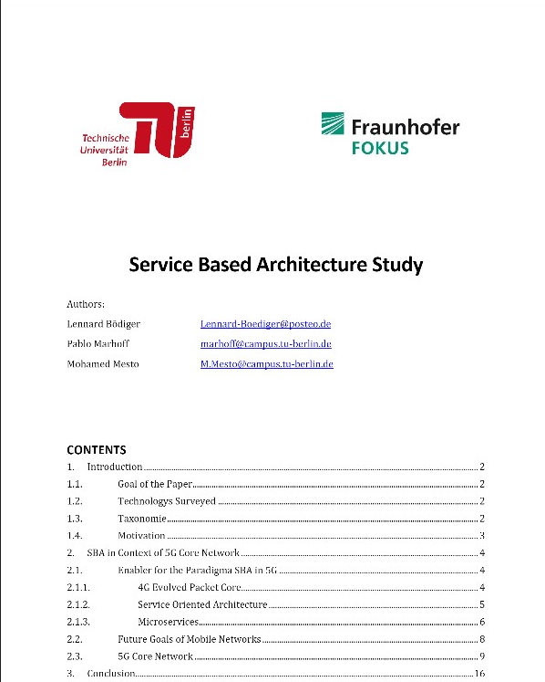
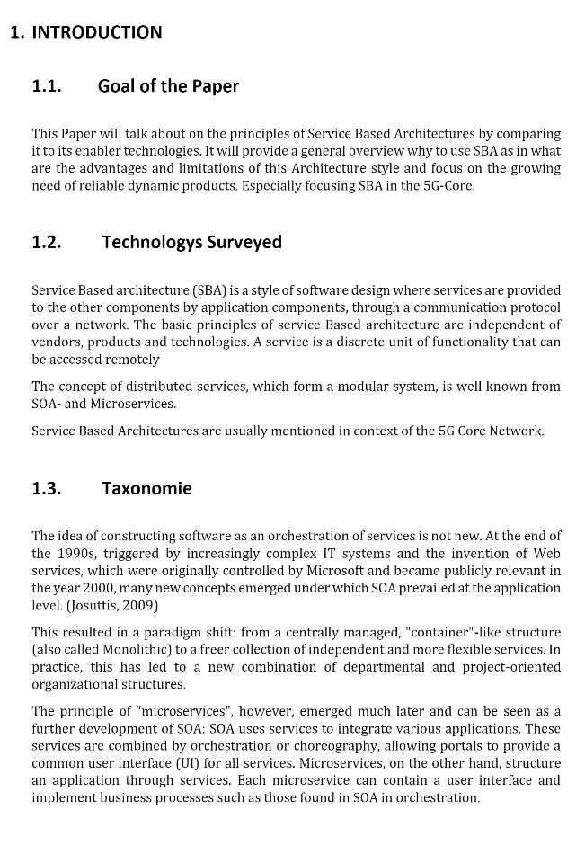
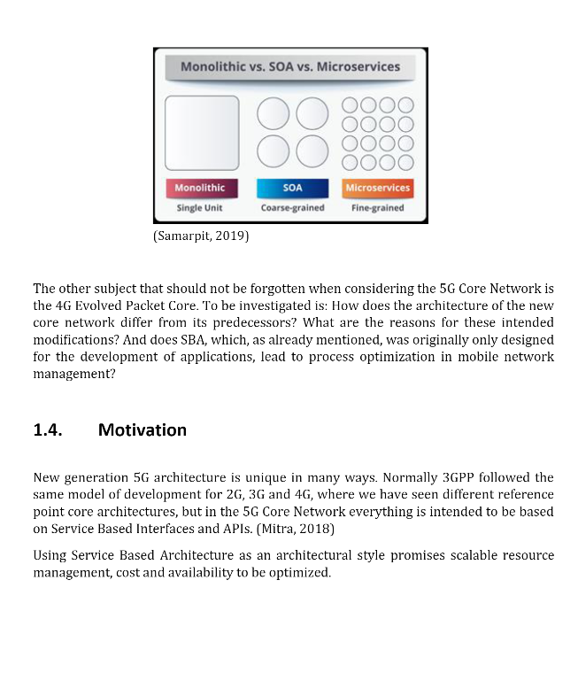
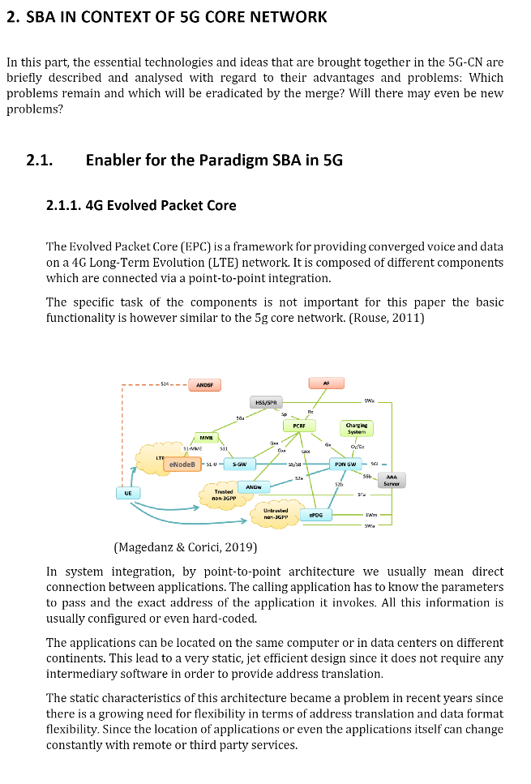

<table border=0>
<tr border=0>
<td>  </td>
  <td align="center"> <h5><a href="https://www.fokus.fraunhofer.de/en">by Fraunhofer Fokus Institute for Open Communication Systems (Fokus) Institute.</a></h5> </td>
  <td>  </td>
</tr>
<tr border=0>
<td> </td><td  align="center"> Seminar Topic  </td><td> </td>
</tr>
<tr border=0>
<td> </td><td> </td><td> </td>
</tr>
  <tr>
    <td> </td>
<td align="center"><h5><a href="https://github.com/fraunhoferfokus">"Service Based Architecture Study"</a></h5></td>
    <td> </td>
</tr>
  <tr>
    <td> </td>  <td align="center"><a href='https://www.av.tu-berlin.de/team/prof_dr_thomas_magedanz/'>Prof. Dr.-Ing. habil. Thomas Magedanz</a>   <a href='https://www.linkedin.com/in/michael-pauls-442473138/'>Michael Pauls</a></td>
    <td> </td>
</tr>
</table>

# Service Based Architecture Study
Goal of the Paper This Paper will talk about on the principles of Service Based Architectures by comparing it to its enabler technologies. It will provide a general overview why to use SBA as in what are the advantages and limitations of this Architecture style and focus on the growing need of reliable dynamic products. Especially focusing SBA in the 5G-Core.

## Evaluation Grade from Fraunhofer Fokus Institute

2.3 

## Contributors
- Mohamed Mesto, m.mesto@campus.tu-berlin.de  , Mohamedmesto111@gmail.com
- Lennard Bödiger, Lennard-Boediger@posteo.de
- Pablo Marhoff, marhoff@campus.tu-berlin.de

## License & copyright
© Mohamed Mesto
License under the [MIT License] (LICENSE).

